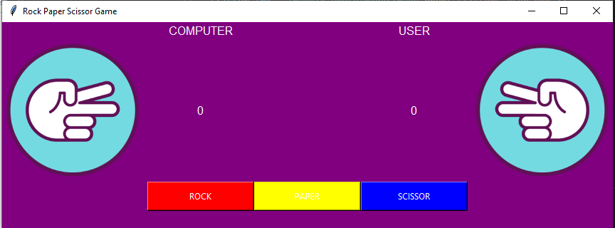

# Rock Paper Scissor Game GUI  


This Rock Paper Scissor Game Is Made Using Python3 & tkinter Module.
use mouse keys to click on the buttons shown on the screen to select your move, try to try to win to keep the score increasing. Scores should be displayed on the screen.
program changes the image as you select the move to show on the screen and tells who wins and updates the score
Hope You Will Like The Game. also u can use the code to make your own version of game.


 


> ### To play the game, simply double click on the **rockpaperscissorGUI.exe**.
 :smirk:

### Module used
python modules
```
from tkinter import *
from PIL import Image, ImageTk
from random import randint
```

## PRE-REQUISITES
Your laptop with 3.7.x (onwards) installed.

**NOTE:** Those with Linux and MacOSX would have Python installed by default, no action required.

Windows: Download the version for your laptop via https://www.python.org/downloads/

**NOTES**
In your preferred editor, make sure indentation is set to "4 spaces".

* Make sure you have **tkinter** and **Pillow** installed in python otherwise code may fail,
* to install tkinter in your machine > open python in your terminal then type `pip install tkintertable` to install. :warning:
* to install tkinter in your machine > open python in your terminal then type `pip install pillow` to install. :warning:

* random is built-in python module so no need to worry about that.

---

Do not Delete any images Files or IT MAY CRASH THE GAME!

Start The Game Using `rockpaperscissorGUI.exe` File!


## Run using Python3.8+
1. Clone or download repositiory: https://github.com/arevish/rockpaperscissorGUI.git
2. In source folder, run `python3 'rockpaperscissorGUI.py'` to start program, optionally, run with `--help` argument to see other runtime options.


### ThankYou!
